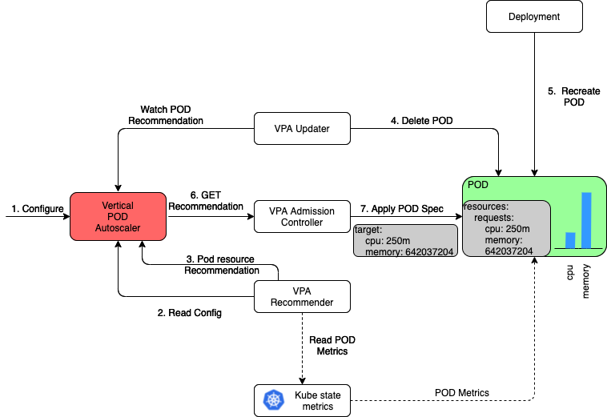

# Project Report : Deploy Vertical Pod Autoscaler operator

Table of contents
- [Terminologies](#Terminologies)
- [Users & Personas of the project](#users--personas-of-the-project)
- [Scope and Features of the project](#scope-and-features-of-the-project)
- [Solution Concept](#solution-concept)
  - [Vertical Pod Autoscaler](#vertical-pod-autoscaler-vpa) 
    - [VPA modes](#vpa-modes)
    - [VPA Architecture](#vpa-architecture)
    - [Logs Observations](#logs-observations)
- [Tech Stack](#tech-stack)
- [Steps to setup VPA](#steps-to-setup-vpa)
  - [Steps to setup VPA](#steps-to-setup-vpa) 
  - [Prerequisites](#prerequisites)
  - [Install VPA operator](#install-vpa-operator-in-your-cluster-in-web-console)
  - [Initial setup](#inital-setup-in-your-namespace)
  - [Create VPA custom resource](#create-vpa-custom-resource-in-your-namespace)
  - [Create VPA Controller](#create-vpa-controller)
  - [How to see VPA recommendations?](#how-to-see-vpa-recommendation)
  - [How to check VPA changing the pod metrics in Initial mode?](#how-to-check-vpa-changing-the-pods-metrics-in-initial-mode)
  - [How to check VPA changing the pod metrics in Auto mode?](#how-to-check-vpa-changing-the-pods-metrics-in-auto-mode)
- [What we accomplished?](#what-we-accomplished)
- [VPA Limitations](#vpa-limitations)
- [Future Work](#future-work)
- [References](#references)
  - [Sprint Demo videos](#sprint-demo-videos) 
  - [External links](#external-links)

## Terminologies

* **Cluster:** A Kubernetes cluster is a set of nodes that runs containerized applications. This cluster can run containers across multiple machines. 

* **Namespace:** In a cluster, namespace enables to provide isolated groups of resources. A cluster may contain multiple namespaces.

* **Pod**: This is the smallest object in Kubernetes. Pods will be deployed in a single node and it runs applications in a set of 1 or more containers. 

* **Service**: A service is a REST object in Kubernetes. It is an abstract way to expose an application as a network service.

* **Route**: Route in kubernetes, exposes the kubernetes service at a host name, so the users can access the applicaiton using this host name.

## Project Goal
In Kubernetes, while actual workloads run within containers, Pods are in fact the smallest deployable
unit of computing. This means that all compute resources (CPU/Memory) for any workload are specified
at the Pod level. In Kubernetes, both forms of compute resources, CPU and Memory, are specified in
similar ways and are done so in a static manner. When managing workloads via Pod, a human operator
will first specify what compute resources this Pod will require operating. It is not uncommon,
however, for a workload to demand more resources at peak times, while remaining mostly dormant
during off-peak hours. As one might expect, this results in either waste of compute resources or
reduced pod performance.

The solution here is to move away from manually specifying the compute resources for a pod that are
static, and opt for a more automated scaling solution. The ideal solution would identify when a Pod
requires additional resources, and adjust its requirements accordingly during the lifetime of the
Pod. The Vertical Pod Autoscaler (VPA) was designed to specifically do this. The VPA will automatically
scale the resources for a pod based on its usage trends.

The goal of this project is to transform Operate First OCP clusters from manually specifying compute
resource requirements for pods and to use the VPA instead. Thus having all workloads automatically
scale up/down their resources on a need basis. In addition, resource of some services in the
Operate-First organization are not utilizing well. The Trino cluster is one of them, which receives
more request during some events in some years, and it requires the service to use resources more
effectively during these times. This also means that in other years the assigned resources to the
service, will be idle and will cause waste of resources. VPA brings a solution to that.

## Users & Personas of the project

Our end-users are:

1. DevOps engineers - monitoring and managing resource utilization. 
2. Developers - deploying kubernetes/OpenShift applications or clusters.
3. Cluster administrators - managing every cluster in a multi-cluster environment.

The purpose here is to have better CPU and memory utilization. DevOps developers and operators are touching clusters and they need to make sure to manage their resources efficiently.

VPA scales pod utilization by sending CPU and memory requests based on utilization. With the help of the monitorization of resources, users can also track to see how VPA contributed to effectiveness.

## Scope and Features of the project

The scope of the project includes configuring Vertical Pod Autoscaler(VPA) through GitOps and tracking the efficiency in CPU/Memory utilization of an application deployed on the Kubernetes cluster with the fluctuating workload.

### Features/Major Milestones
- [X] Install the VPA autoscaler via GitOps
- [X] Identify an application to serve as a candidate for VPA testing
- [X] Create a POC in a demo k8s namespace showcasing VPA working
- [X] Implement VPA for a live running service for heavy/fluctuating compute workloads
- [X] Track CPU/Memory utilization in Grafana, confirming results
- [X] Proceed to implement VPA for all compute heavy workloads

## Solution Concept

### Vertical Pod AutoScaler (VPA)

Vertical Pod Autoscaler automatically updates the limits and requests of resources (both CPU and memory) by reviewing the historic resource usages and as well their current. 

#### VPA modes 
VPA can be configured in three different modes. They are
1. Off - VPA does not change the pod's request and limit. Just gives the recommendations for the containers.
2. Initial - VPA applies the recommendations only during the pod's creation. 
3. Auto - VPA automatically applies the recommendations when the resource usage goes beyond the lowerbound and upperbound.

#### VPA Architecture

VPA Architecture [Image Source](https://banzaicloud.com/blog/k8s-vertical-pod-autoscaler/)

VPA has three importent components. 
1. VPA recommender
2. VPA admission controller
3. VPA Updater

##### VPA Recommender 
VPA Recommender continously monitors the pod's resource levels (in our project, it gets the pod's resource levels using kube state metrics) and provides the recommendation values It also fills the recommendations in the VPA resource's output only field. 

These recommendations will have the following four fields:
1. LowerBound - minimum resource levels recommended
2. Target - the recommended resource level
3. Uncapped Target - the recommended resource levels, without considering the `minAllowed` and `maxAllowed` restrictions in VPA
4. UpperBound - maximum resource levels recommended

##### VPA Admission Controller
VPA admission controller acts only during two modes. `Auto` and `Initial`. It intercepts the pod's creation and updates their requests and limits with the recommended resources. 
VPA admission controller calls the VPA recommender to get the recommended resources. It works in both pod's creation and recreation. 

##### VPA Updater
VPA Updater acts only during the `Auto` mode. VPA Updater is responsible for updating the resource levels in the running pod. 

##### How and when does VPA updates the live running pod?
VPA Updater continously montiors the resource levels and gets the recommendations from the VPA recommender. If the pod's resource requests, goes below the lowerbound or goes above the upperbound, VPA updater evicts the pod. The pod recreation will not be initiated by any of the VPA components. For this, VPA depends on the deployment's replicaset, resource policy and so on. 
During the pod's recreation, it is the admission controller's job to apply the recommended resources. 

#### Logs Observations

#### Log level
Once the VPA operator is installed (refer this on how to install), it creates a default pod for each components. Initial log level for these VPA pods will be 1. You need to change the log level to atleast 4 to see the vpa logs such as metrics changed in Auto mode, creation mode and also the recommendations.

#### Logs 
##### VPA Recommender logs
It will log when the recommendations have been changed.

##### VPA Admission Controller logs
It will log when the pod's resource recommendations are applied to the pod's creation/recreation. 

##### VPA Updater logs
It will log why the pod needs to be updates, and also logs why the pod need not be updated because they are well within the upper and lower limits. 

## Tech Stack
- RedHat OpenShift Cluster Platform (OCP)
  -  Note: VPA is provided by Kubernetes, so you can work with VPA with any other cloud platform, but we have used OCP and hence the instructions are provided for that here.
- Resource Consumer application
  -  Resource Consumer is an application tool to to generate the CPU/Memory workload inside a container.
  -  It starts the HTTP server when deployed, listens to requests at default port 8080 and handles those reqests.
  -  We use this application to test the vertical pod autoscaling by sending various HTTP load requests to resource consumer. 
 

## Steps to setup VPA
You can setup these steps using kubectl in your terminal or through OpenShift Cluster web page. Both the ways are mentioned these. We would recommend using kubectl as it is much easier.  

### Prerequisites
We are assuming that you already have the following:
- a RedHat OpenShift Cluster Platform (OCP) and namespace ready to work on. 
- admin access in your cluster (This is required to install VPA operator in your cluster)
- kubectl installed in your local machine
- openshift command line interface installed. Refer [this link](https://docs.openshift.com/container-platform/4.2/cli_reference/openshift_cli/getting-started-cli.html#cli-installing-cli-on-macos_cli-developer-commands)
- [Only for kubectl] login to your OCP in terminal (Use copy login command)

### Install VPA operator in your cluster in web console
1. In OCP, click on "Operators" -> "Operator Hub"
2. Choose " VerticalPodAutoscaler" and click Install
3. On the Install Operator page, ensure that the Operator recommended namespace option is selected. This installs the Operator in the mandatory openshift-vertical-pod-autoscaler namespace, which is automatically created if it does not exist.
4. Click Install.
5. Verify the installation by listing the VPA Operator components:
  1. Go to Workloads → Pods.
  2. Select the openshift-vertical-pod-autoscaler project from the drop-down menu and verify that there are four pods running.
  3. Navigate to Workloads → Deployments to verify that there are four deployments running.
6. [Optional] Verify the installation in the OCP CLI using the following command:
`$ oc get all -n openshift-vertical-pod-autoscaler`

### Inital Setup in your namespace

#### Create a deployment

##### Using kubectl
1. Create a yaml file with the [exact yaml entries](https://github.com/TheGreymanShow/vertical-pod-autoscaler-operator/blob/main/install/rc-depl.yaml)
2. [Optional] you can change the name of the deployment, containers and app.
3. Execute the command `kubectl apply -f <deployment-yaml-file>`

##### Using Web Console
1. Go to "Workloads" in your namespace under "Administrator" tab in moc/smaug.
2. Click on "Deployments" on the left side navigation bar.
3. Click on "Create Deployments" button which will open the yaml file. 
4. The yaml file will have preloaded entries, delete all of them.
5. Now, [copy and paste this exact yaml entries](https://github.com/TheGreymanShow/vertical-pod-autoscaler-operator/blob/main/install/rc-depl.yaml).
6. [Optional] you can change the name of the deployment, containers and app.
7. Click on "Create"

#### Create a service

##### Using kubectl
1. Create a yaml file with the [exact yaml entries](https://github.com/TheGreymanShow/vertical-pod-autoscaler-operator/blob/main/install/rc-service.yaml).
2. [Optional] you can change the name of the service.
3. Execute the command `kubectl apply -f <service-yaml-file>`

##### Using Web Console
1. Go to "Networking" in your namespace under "Administrator" tab in moc/smaug.
2. Click on "Services" on the left side navigation bar.
3. Click on "Create Service" button which will open the yaml file.
4. The above yaml file will have preloaded entries, delete all of them.
5. Now, [copy and paste this exact yaml entries](https://github.com/TheGreymanShow/vertical-pod-autoscaler-operator/blob/main/install/rc-service.yaml).
6. Verify the "app" entry matches the deployment of app you created.
7. [Optional] you can change the name of the service.
8. Click on "Create"

#### Create a route 

##### Using kubectl
1. Create a yaml file with the [exact yaml entries](https://github.com/TheGreymanShow/vertical-pod-autoscaler-operator/blob/main/install/rc-route.yaml).
2. Verify the "name" entry of the service under spec: matches the name of the service you created.
3. [Optional] you can change the name of the route.
4. Execute the command `kubectl apply -f <route-yaml-file>`

##### Using Web Console
1. Go to "Networking" in your namespace under "Administrator" tab in moc/smaug.
2. Click on "Routes" on the left side navigation bar.
3. Click on "Create Route" button which will open the yaml file.
4. The above yaml file will have preloaded entries, delete all of them.
5. Now, [copy and paste this exact yaml entries](https://github.com/TheGreymanShow/vertical-pod-autoscaler-operator/blob/main/install/rc-route.yaml).
6. Verify the "name" entry of the service under spec: matches the name of the service you created.
7. [optional] you can change the name of the route.
8. Click on "Create"

NOTE: We use this route to send requests to our resource consumer application deployed. 

### Create VPA Custom Resource in your namespace 

#### Using kubectl
1. Create a yaml file with the [exact yaml entries](https://github.com/TheGreymanShow/vertical-pod-autoscaler-operator/blob/main/install/rc-vpa.yaml)
2. Change the following entries in the above yaml file:
      1. Change the "namespace" under metadata, to your namespace name   
      2. Change the "updateMode" to Initial. `updateMode: Initial` (since we are testing this one first)
3. Execute the command `kubectl apply -f <vpa-deployment-yaml-file>`

#### Using Web Console
1. In Administrator tab, click on "Home" -> "API Explorer".
2. Type "VerticalPodAutoscaler" in filter by kind text box on the top right.
3. Click on "VerticalPodAutoscaler". (any version (v1/v1beta) is fine).
4. Click on "Instance" -> "Create VerticalPodAutoscaler" button, which will open the yaml file.
5. The above yaml file will have preloaded entries, delete all of them.
6. Now, [copy and paste this exact yaml entries](https://github.com/TheGreymanShow/vertical-pod-autoscaler-operator/blob/main/install/rc-vpa.yaml)
7. Change the following entries in the pasted yaml file:
      1. Change the "namespace" under metadata, to your namespace name.
      2. Change the "updateMode" to Initial. `updateMode: Initial` (since we are testing this one first)
9. Click on "Create"

### Create VPA Controller

#### Using kubectl
1. Create a yaml file with the [exact yaml entries](https://github.com/TheGreymanShow/vertical-pod-autoscaler-operator/blob/main/install/rc-vpa-controller.yaml)
2. Change the following entries in the pasted yaml file:
      1. Change the "namespace" under metadata, to your namespace   
3. Execute the command `kubectl apply -f <vpa-deployment-yaml-file>`

#### Using Web Console
1. In Administrator tab, click on "Home" -> "API Explorer".
2. Type "VerticalPodAutoscalerController" in filter by kind text box on the top right.
3. Click on "VerticalPodAutoscalerController".
4. Click on "Instance" -> "Create VerticalPodAutoscalerController" button, which will open the yaml file.
5. The above yaml file will have preloaded entries, delete all of them.
6. Now, [copy and paste this exact yaml entries](https://github.com/TheGreymanShow/vertical-pod-autoscaler-operator/blob/main/install/rc-vpa-controller.yaml)
7. Change the following entries in the pasted yaml file:
      1. Change the "namespace" under metadata, to your namespace   
9. Click on "Create"

### How to see VPA recommendation? 
You can see VPA recommendations through ocp command line in terminal or in your OCP web console. We will list both the ways here

#### Using kubectl 
`kubectl get vpa <vpa-custom-resource> --output yaml`

#### Using OCP web console
1. In Administrator tab, click on "Home" -> "API Explorer".
2. Type "VerticalPodAutoscalerController" in filter by kind text box on the top right.
3. Click on "VerticalPodAutoscalerController"
4. Select the instance you created. 
5. In the yaml file, your should see recommendations like below

TODO: Attach a photo of recommendations here. 

### How to check VPA changing the pod's metrics in Initial mode?

#### Change the workload
For the recommendations to change, we need to change the workload. We can do this by the below steps.

1. Copy the route you created for your deployment. 
2. Copy and paste the following command in your terminal. 

`curl --data "millicores=200&durationSec=300" <your-route>/ConsumeCPU`

The above commands sends a request to increase the CPU load to 500 millicores for 300 seconds (5 minutes). Now you need to wait for 5 minutes for the request to finish.

#### Check the recommendations
Now check the recommendations, it should be changed from the initial one. 
If not, increase the `durationSec=1800` (30 minutes) and try again. 
Once the recommendations changes, move to the next step.

#### Delete the pod
- Delete the pod of your deployment, the pod will be automatically recreated since the resource policy is rolling-update. 
- The newly created pod will have the request value equal to the 'target' provided by the vpa recommendations.  

### How to check VPA changing the pod's metrics in Auto mode?
1. Use [this step](https://github.com/TheGreymanShow/vertical-pod-autoscaler-operator/blob/main/README.md#create-vpa-custom-resource-in-your-namespace) to update the `updateMode` to `Auto`. 
2. Now [follow this step]() to change the workload to 500 for 5 hours. 
3. Then, VPA should have updated the pods automatically. 
4. If the pods are not automatically updated, follow step 2 again. This should do it. 

NOTE: VPA Auto mode does not instantly update the pod. Please refer the limitations for further details. 

## What we accomplished?
1. Successfully installed VPA Operator in Operate-First Kubernetes cluster (staging and production environments of Smaug cluster).
2. Made Trino application of Operate-First define CPU/Memory resource requirments dynamically, rather than static declaration (staging and production environments).
3. Created a Grafana dashboard than can visualize CPU/Memory utilization, requests and limits at pod level, helping to monitor effectiveness of VPA to any service.
4. Experimented various usage patterns of application CPU/Memory resources to determine if VPA is suitable for such candidates. 
5. Documented VPA results that Operate-First team can refer to find suitable candidates for VPA, setup guidelines and our recommendations. 

### Our Pull Requests
- https://github.com/operate-first/apps/pull/1398
- https://github.com/operate-first/apps/pull/1260
- https://github.com/operate-first/apps/pull/1175
- https://github.com/operate-first/apps/pull/1374
- https://github.com/operate-first/apps/pull/1393
- https://github.com/operate-first/apps/pull/1171

## Project Timeline
All the user stories and tasks of each sprint will be available in our [Taiga board](https://tree.taiga.io/project/amanbatra-cs6620-fall21-deploy-vertical-pod-autoscaler-operator/timeline). 

## VPA Limitations
1. VPA adjusts the CPU and memory allocation values of a pod by deleting and re-created new pod with updated configs. Even though rolling deployment can be configured, this is not desirable for some applications as it restarts the pods. Updating running pods is an experimental feature of VPA.
2. VPA does not instantly react to varying workload. Instead, it provides stable recommendations over a longer time period. For sudden increases, Horizontal Pod Autoscaler is a better option.
3. VPA recommendation might exceed available resources (e.g. Node size, available size, available quota) and cause pods to go pending. Lets say your node has only 8gb memory, but VPA can actually recommend 10gb, as it does not consider available resource quota. So we have to manually set boundaries to avoid problems. We have solved this problem by setting `minAllowed` and `maxAllowed` [config](https://github.com/kubernetes/autoscaler/blob/master/vertical-pod-autoscaler/pkg/apis/autoscaling.k8s.io/v1/types.go#L153) values to define boundaries for VPA.
4. VPA metrics are not exposed from kube-state-metrics by default, as its a custom resource. We have to pass a flag to enable VPA collector. [Steps to do this.](https://github.com/kubernetes/kube-state-metrics/blob/master/docs/verticalpodautoscaler-metrics.md#configuration)
5. By default VPA’s minimum memory recommendation is 250mb. So it may not be useful for applications that consume very low amount of resources.
6. Vertical Pod Autoscaler should not be used with the Horizontal Pod Autoscaler (HPA) on CPU or memory at this moment. However, VPA can be used with HPA on custom and external metrics.
7. VPA performance has not been tested in large clusters.

More details about both advantages and limitations of VPA is documented [here](https://github.com/TheGreymanShow/vertical-pod-autoscaler-operator/blob/main/design_documents/vpa-limitations.md).

## Future Work
1. Expose the VPA recommendations metrics using kube-state-metrics to query in PromQL. [Refer this](https://github.com/kubernetes/kube-state-metrics/blob/master/docs/verticalpodautoscaler-metrics.md).
2. Install VPA in Jupyter Lab namespace in OCP
      1. Jupyter Lab namespace does not have deployments only has pods. (VPA only works with Deployments, StatefulSets, DaemonSets, ReplicaSets etc. You cannot use it with a standalone Pod that does not have an owner.)
      2. Hence, we can create a custom controller and associate it with pods and associate the created custom controller to VPA custom resource.

## References

### Sprint demo videos
* Sprint 1: https://www.youtube.com/watch?v=ywLisR5bDBU
* Sprint 2: https://www.youtube.com/watch?v=UBJ5ZRhaJ8E
* Sprint 3: https://www.youtube.com/watch?v=Fw19E8Pim98
* Sprint 4: https://www.youtube.com/watch?v=yjxxSzkpgz8
* Sprint 5: https://www.youtube.com/watch?v=Got3TFkyAlA

### Blog post
First draft: https://github.com/TheGreymanShow/vertical-pod-autoscaler-operator/blob/main/blogpost.md

### Documents
* Project proposal/description: https://github.com/TheGreymanShow/vertical-pod-autoscaler-operator/blob/main/project-description.md
* Candidate analysis to simulate CPU/Memory workload: https://github.com/TheGreymanShow/vertical-pod-autoscaler-operator/blob/main/design_documents/vpa-load-testing-candidate.md (Chosen candidate: Resource consumer)

### External Links
- [VPA Design proposal](https://github.com/kubernetes/design-proposals-archive/blob/main/autoscaling/vertical-pod-autoscaler.md)
- [VPA Operator documentation](https://docs.openshift.com/container-platform/4.5/nodes/pods/nodes-pods-vertical-autoscaler.html)
- [Resource Consumer](https://github.com/kubernetes/kubernetes/tree/master/test/images/resource-consumer)
