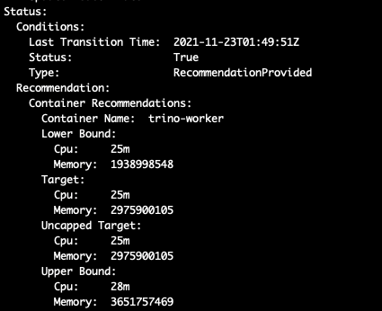
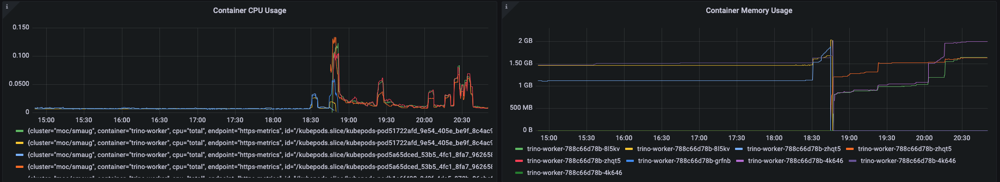
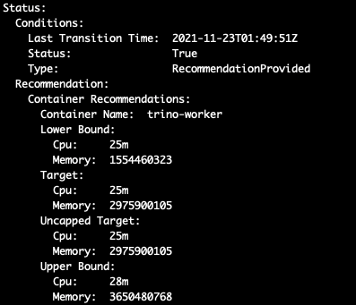
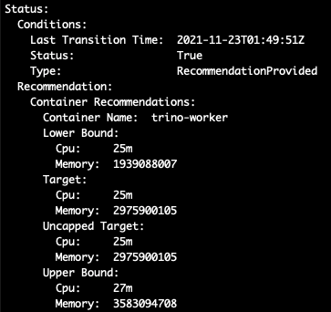
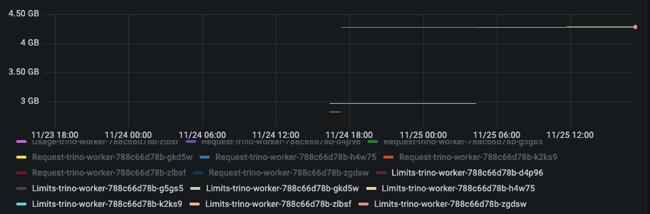
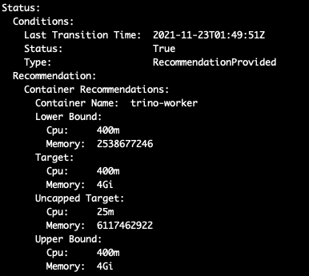
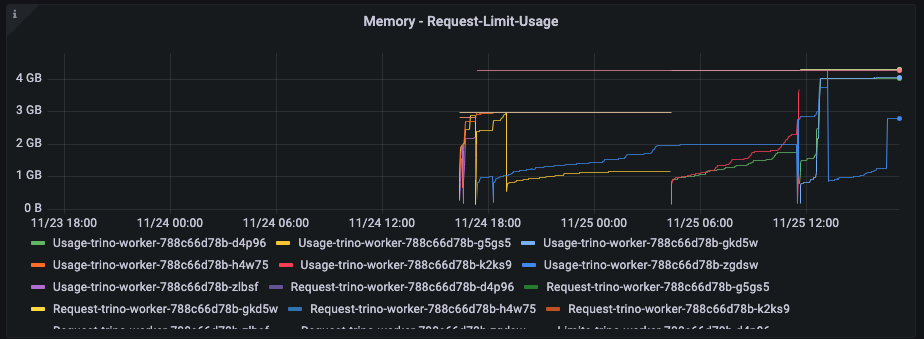

### VPA observations on Trino-Staging namespace

VPA Spec:

```
apiVersion: "autoscaling.k8s.io/v1"
kind: VerticalPodAutoscaler
metadata:
  name: trino-stage-v1
  namespace: opf-trino-stage
  labels:
    app: trino-stage-v1
spec:
  targetRef:
    apiVersion: "apps/v1"
    kind: Deployment
    name: trino-worker
  updatePolicy:
    updateMode: "Auto"
  resourcePolicy:
    containerPolicies:
    - containerName: "trino-worker"
      maxAllowed:
        cpu: "3000m"
        memory: "4Gi"

```

Initial VPA reco on creation:

​		 

3651757469 =~ 3.65 gb upper bound

1938998548 = ~2gb lower bound

2975900105 =~ 3gb target

Usage at the time of creation:

2021-11-22 20:49:40 

After VPA is enabled, pods got auto-updated with values immediately:

```
    Limits:
      cpu:     25m
      memory:  2975900105
    Requests:
      cpu:     25m
      memory:  2975900105
```

CPU is reduced from 500m to 25m

Memory is increased from 2gb to ~3gb


=====

Recommendation after 15mins of VPA creation:



Recommendation after 12hours of VPA creation:



=====

After 1 day:

After running some big queries for a period of time, memory limit raised from 3gb to 4gb.







